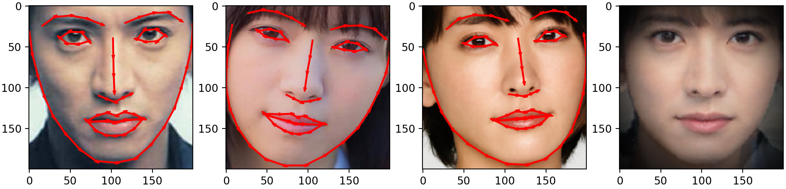
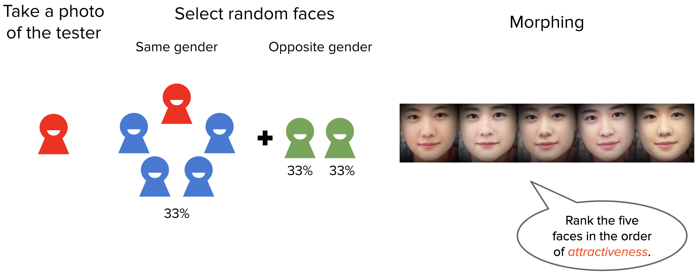

# Face Image Morphing
Final project of Interactive Computer Graphics 2020 Spring, NTU CSIE

<p align="center">
  
</p>

<p align="center">
  
</p>

## Introduction
This repository is a simple program for face image morphing implemented in python3.
The program can be split into two parts: face feature extraction and 2D image morphing. For the feature extraction part, we used [OpenCV](https://github.com/skvark/opencv-python) and [dlib](https://github.com/davisking/dlib) packages following the instructions from an [article](https://www.pyimagesearch.com/2017/04/03/facial-landmarks-dlib-opencv-python/).
While the 2D image morphing program is an implementation of the paper **Feature-based image metamorphosis**<sup>[1](#Reference)</sup> in [Numpy](https://numpy.org/).

## Instructions
### Step 1. Download Facial Landmark Detector
Download and decompress the facial landmark detector model from the [dlib website](http://dlib.net/files/shape_predictor_68_face_landmarks.dat.bz2).

### Step 2. Modify Scripts
Modify the variable `shape_pr` in scripts `run.sh` or `run3.sh` to the path to the facial landmark detector on your computer.

### Step 3. Face Image Morphing
#### Morphing two images
```
bash run.sh <image 1> <image 2> <ratio> <directory for output images> [name of the morphed image]
```
Note that the `ratio` is the interpolation ratio between the two images. `ratio = 0` represents the output image will be the first image, while `ratio = 1` represents the output image will be the second image.

#### Morphing three images
```
bash run3.sh <image 1> <image 2> <image 3> <directory for output images> [name of the morphed image]
```
The morphing ratio of the three images is set to 33%:33%:33% (`ratio_1 = 0.5` and `ratio_2 = 0.333`).

### Other Methods
#### Feature Extraction Class
This class is in `src/feat_extract.py` called `FaceFeatureExtractor`.
The only parameter required is the path to the facial landmark detector model.
You may modify the `crop_to_face` function in the .py file to crop to your desired area.

#### 2D Image Morphing Class
This class is in `src/morphing_np.py` called `Morphing`.
There are three optional parameters: `a`, `b`, and `p`, controlling the weighting for each line shown in the original paper<sup>[1](#Reference)</sup>.

## Experiments
We conducted experiments for verifying whether people are attracted to people who look like them.
<p align="center">
  
</p>

The `generate.py` generate images for the experiment, it can be used as follow:  

```
python3 generate.py <image of tester> <gender m/f> <image dataset> <list of images> <output directory>
```
The images in the image dataset must be named with beginning of `m` or `f` for male or female, respectively.
The output images will be stored at the specified directory.

## Reference
1. [T. Beier and S. Neely, "Feature-based image metamorphosis", SIGGRAPH, 1992](https://www.cs.princeton.edu/courses/archive/fall00/cs426/papers/beier92.pdf)

